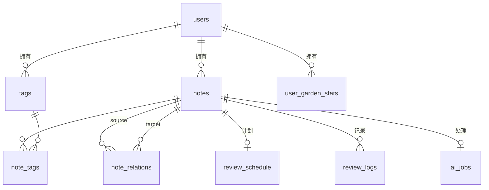

# "第二大脑"——AI 知识花园
## 详细需求与设计方案（重构版 v2.0）

---

## 0. 文档说明

| 项 | 说明 |
|---|---|
| 文档版本 | v2.0（重构版） |
| 状态 | 待评审 |
| 关联文档 | 《需求.md》（原始需求 v1.0） |
| 适用范围 | 全栈开发 4 周周期，前后端、数据库、算法、验收标准全覆盖 |

**本次重构相对原始需求的主要变化：**

1. 统一了"生命周期状态机"，明确 `seed → growing → mature → wilted` 的状态定义、转换触发条件与副作用（原需求中"种子/生长中/成熟/枯萎"多处含义不一致）。
2. 解决向量存储双写矛盾：**向量只存 ChromaDB**，移除 PostgreSQL 中的 `note_embeddings` 表（原需求 §三 与 §四 自相矛盾）。
3. 标签从 notes 表内嵌数组升级为独立 `tags + note_tags` 多对多模型，支持计数、重命名、合并与颜色管理。
4. 新增 `users`、`review_logs`、`ai_jobs` 三张表，补齐认证、复习历史与 AI 任务状态追踪。
5. 新增异步任务队列设计，AI 流水线与笔记 CRUD 解耦，杜绝 LLM 慢响应阻塞主接口。
6. 所有功能模块补充**验收标准（AC）**与**交互细节**；算法、API、前端、非功能需求补齐到可直接开发的详细度。

---

## 1. 项目概述

### 1.1 项目背景与定位

在信息爆炸时代，个人知识碎片化严重：笔记孤岛化、难以检索、更难以建立跨主题关联。"第二大脑"希望把"记录"升级为"知识资产运营"——系统以"花园"为隐喻，让知识像植物一样有生命周期，AI 承担"园丁"职责。

**一句话定位：** 融合笔记管理、AI 自动加工与知识图谱可视化的个人知识操作系统。

### 1.2 核心差异化卖点

| 卖点 | 说明 | 对应模块 |
|---|---|---|
| ① 自动知识关联 | 新笔记写入后自动与已有知识建立语义关联，AI 生成"关联理由" | 模块 B / C |
| ② 动态知识图谱 | D3.js 力导向图实时呈现隐性知识网络 | 模块 C |
| ③ 知识生命力游戏化 | 生命周期状态 + 间隔重复复习 + 花园看板，形成留存闭环 | 模块 D / F |

### 1.3 目标用户与核心场景

**目标用户：** 深度知识工作者、学生与终身学习者（对隐私敏感，倾向于本地部署）。

**核心用户故事：**

- US-01：作为技术博主，我在通勤路上快速记下一闪而过的想法，稍后系统自动把它归入知识库并与相关笔记建立关联。
- US-02：作为研究者，我想直观看到"AI 与心理学"两个领域之间有哪些隐藏关联。
- US-03：作为忙碌用户，我不想维护复杂的文件夹结构，希望用 AI 打标签 + 语义搜索代替人工整理。

### 1.4 设计原则

1. **零成本归档**：记录只需"写"一件事，标签、摘要、关联全部由 AI 完成，用户可后置修正。
2. **被动发现**：关联、复习提醒、枯萎预警由系统主动推送，而非用户主动查找。
3. **游戏化留存**：通过生命周期与连续记录激励持续使用。
4. **渐进增强**：AI 能力不可用时（如本地无 GPU），系统降级为纯笔记管理仍可完整使用。
5. **本地优先、可迁移**：默认本地 Ollama 推理，数据格式开放，可随时导出。

---

## 2. 核心概念定义（词汇表）

| 术语 | 定义 |
|---|---|
| 笔记（Note） | 知识库最小单元，包含标题、正文（Markdown）、摘要、标签集合 |
| 标签（Tag） | 笔记的领域分类，独立实体，可被重命名/合并/着色 |
| 关联（Relation） | 两篇笔记间语义相似关系（`similarity_score ≥ 0.7`），由 AI 生成关联理由 |
| 生命周期状态 | `seed`（种子）/ `growing`（生长中）/ `mature`（成熟）/ `wilted`（枯萎）/ `archived`（归档） |
| 知识种子（Seed） | 最近 7 天新建、状态为 seed/growing 的笔记在首页的展示形态（🌱） |
| 复习计划（Review Schedule） | 每篇笔记的间隔重复进度（stage 1-5+，next_review_date） |
| 复习日志（Review Log） | 每次"复习"动作的历史记录，用于统计与 streak 计算 |
| 花园（Garden） | 当前用户知识库的整体视图（首页看板） |
| AI 任务（AI Job） | 异步执行的一次 AI 处理流水线，带状态（pending/processing/done/failed） |

---

## 3. 总体架构

### 3.1 逻辑架构（分层）

```
┌──────────────────────────────────────────────────────────────┐
│  前端  React 18 + TS + Vite                                   │
│  ┌──────────┐ ┌──────────┐ ┌──────────┐ ┌──────────┐ ┌─────┐ │
│  │花园首页   │ │笔记编辑器  │ │知识图谱   │ │搜索页    │ │设置 │ │
│  └──────────┘ └──────────┘ └──────────┘ └──────────┘ └─────┘ │
│  数据层：TanStack Query / zustand      HTTP：axios            │
└──────────────┬───────────────────────────────────────────────┘
               │ REST(JSON) + Bearer JWT
┌──────────────▼───────────────────────────────────────────────┐
│  后端  FastAPI + asyncio（模块化）                             │
│  auth │ notes │ ai_pipeline │ graph │ search │ garden        │
│  review │ import │ scheduler │ stats                         │
│  任务队列：ARQ(Redis) / 轻量 asyncio.Queue（降级）              │
└───────┬────────────┬──────────────┬────────────┬─────────────┘
        ▼            ▼              ▼            ▼
  ┌──────────┐ ┌──────────┐ ┌─────────────┐ ┌────────────┐
  │PostgreSQL│ │ ChromaDB │ │ Ollama /    │ │ Redis      │
  │(业务数据) │ │(向量存储) │ │ OpenAI API  │ │(队列/缓存/  │
  │          │ │          │ │(LLM/嵌入)   │ │ 任务状态)   │
  └──────────┘ └──────────┘ └─────────────┘ └────────────┘
```

### 3.2 技术选型与理由

| 层次 | 选型 | 理由 |
|---|---|---|
| 前端框架 | React 18 + TypeScript + Vite | 生态成熟、类型安全、构建快 |
| UI 样式 | Tailwind CSS | 快速定制"花园"视觉风格，深色模式支持 |
| Markdown 编辑器 | TipTap 或 Milkdown（ProseMirror 系） | 所见即所得 + 实时预览 + 插件生态 |
| 图谱可视化 | D3.js（d3-force + d3-zoom + d3-drag） | 力导向图定制自由度最高；节点 < 2000 无需 Three.js |
| 状态管理 | Zustand | 轻量、无样板代码 |
| 数据请求 | TanStack Query（react-query） | 缓存、轮询、乐观更新开箱即用 |
| 后端 | FastAPI + asyncpg + Pydantic v2 | 异步高性能、自动 OpenAPI 文档 |
| 业务数据库 | PostgreSQL 16 | JSONB、全文检索（tsvector）、TEXT[] 支持完善 |
| 向量库 | ChromaDB | collection 管理简单、单机部署；备选 pgvector（见 D1） |
| LLM 推理 | DeepSeek（云端，默认）/ Ollama（本地，可选）/ OpenAI 兼容 API | 可切换，经 Provider 抽象 |
| 任务队列 | ARQ（Redis）；演示环境降级为 FastAPI BackgroundTasks | AI 流水线异步化 |
| 缓存 | Redis | 看板聚合、搜索缓存、任务进度、JWT 黑名单 |
| 部署 | Docker Compose | 一键启动全部服务 |

### 3.3 部署架构（Docker Compose）

```
服务清单：
  frontend   nginx 静态托管 React 构建产物（端口 80）
  backend    uvicorn（端口 8000）
  postgres   数据持久化卷（端口 5432）
  chromadb   持久化卷（端口 8001）
  redis      持久化卷（端口 6379）
  ollama     可选本地 LLM / bge-m3 嵌入（端口 11434）
```

### 3.4 关键技术决策（修正原需求矛盾）

| # | 原需求问题 | 本方案决策 |
|---|---|---|
| D1 | §三 架构图说向量存 ChromaDB，但 §四 又有 `note_embeddings` 表（Postgres VECTOR） | **向量唯一来源 = ChromaDB**，Postgres 不存 embedding，避免双写一致性；备选方案为 pgvector（二选一），代码层做向量存储抽象 |
| D2 | "种子"含义不统一（首页=近7天笔记 / 图谱=新笔记 / 状态枚举无 seed） | 统一为生命周期状态机（§5.3）：`seed→growing→mature→wilted`，"今日种子" = 最近 7 天创建、状态为 seed/growing 的笔记 |
| D3 | 有 `/api/tags` 与"标签管理页"，但标签只是 notes 数组字段 | 升级为 `tags` + `note_tags` 多对多模型，支持计数/重命名/合并/颜色 |

**其他重要决策：**

- D4：**AI 流水线异步化**。`POST /api/notes` 同步保存笔记后立即返回 201，AI 处理作为 `ai_jobs` 入队执行；前端轮询"处理状态"展示进度。
- D5：**LLM 与 Embedding 走 Provider 抽象**。`deepseek`（默认）与 `ollama`、`openai_compatible` 三类 Provider；嵌入默认走 Ollama bge-m3，嵌入维度可配置（默认 1024）。
- D6：**降级策略**。LLM 或 ChromaDB 不可用时：笔记 CRUD、全文搜索、手工标签仍可用；AI 功能标记降级并允许手动重试。

---

## 4. 功能需求

> 优先级：P0 = MVP 必须；P1 = 二期/亮点；P2 = 可延后。每个功能点给出**验收标准（AC）**。

### 模块 A：笔记管理（P0）

**A1. Markdown 编辑与实时预览**
- 编辑模式：分屏（编辑区 + 预览区）与"所见即所得"两种模式可切换。
- 支持 GFM（表格、任务列表、代码高亮、脚注）与数学公式（KaTeX）。
- 自动保存：内容变更 2s 防抖后调用 `PUT /api/notes/{id}`，顶部显示"已保存 / 保存中"状态。
- AC-1：输入 `# 标题`、`- [ ] 任务`、```` ```代码 ```` 均能正确渲染；刷新后内容不丢失。

**A2. 快速捕获（Quick Capture）**
- 全局快捷键（默认 `Ctrl+Shift+K`）唤起悬浮捕获框（类似 Notion）。
- 捕获框支持多行纯文本/Markdown；提交后创建为草稿笔记，立即进入 AI 流水线。
- AC-2：在任何页面按快捷键均能唤起；提交后 5s 内出现在笔记列表中。

**A3. 多格式导入**
| 格式 | 解析方式 |
|---|---|
| PDF | pdfplumber 提取文本（多栏/复杂表格输出为线性文本并说明局限），保存正文后触发 AI 流水线 |
| Markdown | 解析 frontmatter（若有）→ 标题 / 标签，正文保留 Markdown |
| 纯文本 txt | 首个非空行作为标题，其余为正文 |
- 支持批量导入（多文件队列，逐个创建并触发流水线）。
- AC-3：导入 PDF 后笔记正文为可编辑 Markdown 文本，且 AI 处理状态最终为 done。

**A4. 笔记 CRUD**
- 创建：`POST /api/notes`（正文必填，标题可空 → 由 AI 生成或取正文首行）。
- 详情：`GET /api/notes/{id}` 返回笔记 + 关联推荐 + 复习状态。
- 更新：`PUT /api/notes/{id}`，标题/正文/标签/摘要均可改；正文大改时可选择"重新处理"（默认关闭）。
- 删除：`DELETE /api/notes/{id}` 级联删除向量、图谱关联、复习计划（v1 硬删除）。
- AC-4：删除笔记后，ChromaDB 向量、图谱边、复习计划同步清除，图谱中不再出现该节点。

**A5. 元数据手动编辑**
- 标题、摘要、标签均可编辑/删除；AI 生成的标签可被替换或合并。
- AC-5：用户修改标签后，标签计数与图谱节点颜色实时更新。

### 模块 B：AI 自动处理流水线（P0，核心）

**B1. 流水线流程（新笔记创建后异步触发）**

```
笔记保存（接口返回 201）
   │
   ▼
ai_jobs 入队（pending）
   │
   ▼  AI Worker 执行（processing）
   ① 生成标题建议（若标题为空）──────────┐
   ② LLM 生成 3-5 个标签 ────────────────┤ 每步独立重试
   ③ LLM 生成一句话摘要 ─────────────────┤（指数退避 1s/5s/30s，最多 3 次）
   ④ 生成向量嵌入，upsert 至 ChromaDB ───┤
   ⑤ 向量检索 Top5 相似笔记 ─────────────┘
   ⑥ 对相似度 > 0.7 的笔记，LLM 生成关联理由
   ⑦ 写入 note_relations + 更新图谱缓存
   ⑧ 状态置 done，notes.status = seed → growing
```

- **失败处理**：任一步失败 → 重试 3 次 → 仍失败则 `ai_jobs.status = failed`，笔记保持可读，前端显示"AI 处理失败，点击重试"（`POST /api/notes/{id}/reprocess`）。
- **幂等性**：`ai_jobs.pipeline_version` 记录处理版本；重新处理时先清理该笔记旧关联与旧向量再重跑。
- AC-6：创建笔记后 30s 内（DeepSeek 云端）标签/摘要/关联全部生成完毕；前端可见处理状态进度。
- AC-7：LLM 服务宕机时，接口仍返回 201，笔记可见，ai_jobs 标记 failed 且用户可手动重试。

**B2. 定时任务（每日 02:00）**
| 任务 | 逻辑 | 说明 |
|---|---|---|
| 枯萎检查 | `last_reviewed_at > 30 天` 的笔记标记为 wilted | 同时预热"即将枯萎"Redis 缓存 |
| 种子生成 | 无独立表；首页"今日种子"直接聚合最近 7 天新建笔记 | 见决策 D2 |
| 关联发现 | 随机采样 50 篇笔记两两计算相似度，发现新关联（§6.3） | 产出"最新关联"事件流 |
| 周报 | 每周一生成上周新建/复习统计 | 以卡片形式落在看板（P1） |
| 统计刷新 | 重算 `user_garden_stats` 并对账 | Redis 缓存失效 |

### 模块 C：知识图谱可视化（P0，核心）

**C1. 数据与渲染规则**

| 维度 | 规则 |
|---|---|
| 节点 | 每篇笔记一个节点；大小 = 关联度（节点关联数 / 全图最大关联数），半径 6~24px |
| 节点颜色 | 按主标签（首个标签）映射 `tags.color`；无标签默认灰色 |
| 节点生命周期 | seed=发光动画（琥珀色）/ growing=绿色 / mature=蓝色 / wilted=灰色半透明 / archived=默认隐藏 |
| 关联线 | 粗细 = similarity_score 归一化（1~4px）；hover 显示分数与理由 |
| 布局 | d3-force：charge 适中；linkDistance 与相似度负相关（越相似距离越近） |

**C2. 交互能力**
- 拖拽节点（拖拽后固定）、滚轮缩放、空白拖拽平移、双击复位。
- 悬停节点：>150ms 延迟显示摘要 tooltip。
- 点击节点：打开抽屉显示笔记详情 + "在编辑器中打开"。
- 搜索高亮：图谱顶部搜索框，匹配节点放大 + 闪烁动画 3s。
- 路径探索：进入"路径模式"后依次点击两个节点 → 请求 `/api/graph/path` → 高亮最短路径，其余节点淡出；可"清除路径"。
- 簇视图：按主标签聚簇，支持"仅显示某标签簇"过滤。
- AC-8：500 节点 / 1500 条边图上，拖拽缩放帧率 ≥ 30fps（无 WebGL 时 ≥ 20fps）。
- AC-9：路径探索返回的路径节点与边高亮，非路径元素 opacity ≤ 0.15。

**C3. 性能与数据量级**
- 前端只拉取轻量子图：节点元数据（id/title/tags/status/summary）+ 边（score/reason）；正文不上传。
- 节点 > 2000 时启用"簇折叠"（按主标签收缩为聚合节点）。
- 后端 `/api/graph/nodes`、`/api/graph/links` 支持 `tag`、`status` 过滤参数。

### 模块 D："花园"首页看板（P1）

| 组件 | 数据来源 | 交互 |
|---|---|---|
| 今日种子 | 近 7 天创建、状态 seed/growing 的笔记（≤ 10 条） | 🌱 图标；点击进详情；可一键复习 |
| 即将枯萎 | 状态 wilted 或距上次复习 > 25 天 | 🥀 图标；点击直接进入复习流程 |
| 推荐复习 | 今日到期的 `review_schedule`（stage 1-5+） | 卡片轮播；"开始复习" |
| 花园统计 | `user_garden_stats` | 总笔记 / 标签 / 关联 / 连续天数 |
| 最新关联 | `note_relations` 最近 24h 新增（join 笔记标题） | "AI 发现《X》与《Y》有关联！" |
| 学习趋势 | 最近 14 天每日笔记数柱状图（P1） | — |

- AC-10：首页 5 类数据由 `/api/garden/dashboard` 一次聚合返回（服务端 join，避免 N+1 查询）。

### 模块 E：搜索与检索（P1）

| 功能 | 实现 |
|---|---|
| 全文搜索 | PostgreSQL `tsvector`（title 权重 A、content 权重 B）；中文分词需 `zhparser`/`pg_jieba`，v1 可退化为 `ILIKE` 兜底 |
| 语义搜索 | 查询文本嵌入 → ChromaDB topK |
| 混合检索 | RRF 融合（§6.4），返回 unified score 与来源标注（全文 / 语义 / 混合） |
| 标签筛选 | `?tag=` 多选（AND/OR 可配），可与时间范围叠加 |
| 时间筛选 | `created_from` / `created_to` |
| 结果展示 | 命中片段高亮，显示标签、摘要、来源徽标 |

- AC-11：关键词搜索与自然语言提问均返回合理结果；混合检索比单一检索 MRR 更高（本地 200 篇测试集对比）。
- AC-12：搜索响应 P95 < 500ms（200 篇数据量级）。

### 模块 F：复习与游戏化（P1）

- **间隔重复**：stage 1-5+，间隔 1/3/7/15/30 天（§6.2）；复习时展示笔记标题 + 摘要 + 正文预览，用户可评"记住了 / 模糊"（v1 可简化）。
- **生命周期联动**：累计复习 ≥ 3 次 → growing→mature；复习后 wilted→growing。
- **连续记录（streak）**：当天有任意"新建 / 复习 / 编辑"动作即计 1 天。
- **成就徽章**（P2，可选）："新芽初绽""千篇一律""百日园丁"。
- AC-13：点击"复习"后 `next_review_date` 按新 stage 计算，当天不再出现在推荐列表。

### 模块 G：用户与认证（P2）

- JWT 登录/注册（`/api/auth/*`）；v1 可内置单用户（首次启动自动创建），保留多用户能力。
- 所有数据按 `user_id` 隔离。
- 密码 bcrypt 哈希；JWT 有效期 7 天。

### 模块 H：设置（P2）

- LLM Provider 配置（DeepSeek API Key / Ollama host / 模型名）。
- 向量维度、相似度阈值（默认 0.7）、TopK（默认 5）。
- 复习间隔自定义（预设 1-3-7-15-30）。
- 主题（明/暗）、图谱配色。
- 数据导出（Markdown/JSON）、清空数据。

---

## 5. 数据模型设计

### 5.1 ER 概览



### 5.2 表结构明细

> 约定：主键统一 UUID v4；时间统一 `TIMESTAMPTZ`；外键均建索引。

**users**
```sql
id            UUID PRIMARY KEY DEFAULT gen_random_uuid()
email         VARCHAR(255) UNIQUE NOT NULL
password_hash VARCHAR(255) NOT NULL          -- bcrypt
display_name  VARCHAR(64)
created_at    TIMESTAMPTZ DEFAULT now()
```

**notes**（替代原版：移除 tags 数组与 view_count 冗余，新增生命周期与处理状态）
```sql
id                UUID PRIMARY KEY
user_id           UUID NOT NULL REFERENCES users(id)
title             VARCHAR(255)               -- 可为空，由 AI 补全
content           TEXT NOT NULL              -- Markdown 正文
summary           TEXT                       -- AI 一句话摘要，可手改
status            VARCHAR(16) NOT NULL DEFAULT 'seed'
                  CHECK (status IN ('seed','growing','mature','wilted','archived'))
processing_status VARCHAR(16) NOT NULL DEFAULT 'pending'
                  CHECK (processing_status IN ('pending','processing','done','failed'))
last_reviewed_at  TIMESTAMPTZ
created_at        TIMESTAMPTZ DEFAULT now()
updated_at        TIMESTAMPTZ DEFAULT now()
索引：(user_id, created_at DESC)、(user_id, status)、(user_id, processing_status)
全文索引：tsvector 生成列（title 'A' + content 'B' 加权）
```

**tags**
```sql
id         UUID PRIMARY KEY
user_id    UUID NOT NULL REFERENCES users(id)
name       VARCHAR(64) NOT NULL
color      VARCHAR(16) DEFAULT '#8B5CF6'
created_at TIMESTAMPTZ DEFAULT now()
UNIQUE(user_id, name)
```

**note_tags**（多对多）
```sql
note_id UUID NOT NULL REFERENCES notes(id) ON DELETE CASCADE
tag_id  UUID NOT NULL REFERENCES tags(id)  ON DELETE CASCADE
PRIMARY KEY (note_id, tag_id)
索引：(tag_id)
```

**note_relations**（知识图谱边，无向去重）
```sql
id               UUID PRIMARY KEY
user_id          UUID NOT NULL REFERENCES users(id)
source_note_id   UUID NOT NULL REFERENCES notes(id) ON DELETE CASCADE
target_note_id   UUID NOT NULL REFERENCES notes(id) ON DELETE CASCADE
similarity_score FLOAT NOT NULL CHECK (similarity_score BETWEEN 0 AND 1)
relation_reason  TEXT                     -- AI 生成的一句话理由
source           VARCHAR(16) NOT NULL DEFAULT 'auto'
                 -- auto=创建时自动发现 / daily=每日任务 / manual=用户手动
created_at       TIMESTAMPTZ DEFAULT now()
UNIQUE (source_note_id, target_note_id)
CHECK (source_note_id < target_note_id)   -- 无向边去重
索引：(user_id, created_at DESC)
```

**review_schedule**（间隔重复计划，一笔记一条）
```sql
id               UUID PRIMARY KEY
note_id          UUID NOT NULL UNIQUE REFERENCES notes(id) ON DELETE CASCADE
review_stage     INT NOT NULL DEFAULT 1          -- 1..5+
next_review_date DATE NOT NULL
created_at       TIMESTAMPTZ DEFAULT now()
索引：(next_review_date)
```

**review_logs**（新增：复习历史，用于统计与 streak）
```sql
id           UUID PRIMARY KEY
note_id      UUID NOT NULL REFERENCES notes(id) ON DELETE CASCADE
reviewed_at  TIMESTAMPTZ DEFAULT now()
stage_before INT NOT NULL
stage_after  INT NOT NULL
result       VARCHAR(8) NOT NULL DEFAULT 'remember'   -- remember / fuzzy
索引：(note_id)、(reviewed_at)
```

**ai_jobs**（新增：AI 任务追踪）
```sql
id               UUID PRIMARY KEY
note_id          UUID NOT NULL REFERENCES notes(id) ON DELETE CASCADE
user_id          UUID NOT NULL REFERENCES users(id)
job_type         VARCHAR(16) NOT NULL DEFAULT 'pipeline'
                 -- pipeline=新建处理 / regenerate=重新处理 / import=导入处理
status           VARCHAR(16) NOT NULL DEFAULT 'pending'
                 -- pending / processing / done / failed
pipeline_version VARCHAR(16)           -- 模型/算法版本，用于幂等
attempts         INT NOT NULL DEFAULT 0
error_message    TEXT
created_at       TIMESTAMPTZ DEFAULT now()
updated_at       TIMESTAMPTZ DEFAULT now()
索引：(user_id, status, created_at)
```

**user_garden_stats**
```sql
id              UUID PRIMARY KEY
user_id         UUID NOT NULL UNIQUE REFERENCES users(id)
total_notes     INT NOT NULL DEFAULT 0
total_tags      INT NOT NULL DEFAULT 0
total_relations INT NOT NULL DEFAULT 0
streak_days     INT NOT NULL DEFAULT 0
last_active     DATE
updated_at      TIMESTAMPTZ DEFAULT now()
```

> 已移除原 `note_embeddings` 表：向量统一存 ChromaDB（决策 D1）。

### 5.3 生命周期状态机

```
               AI 流水线完成            累计复习 ≥ 3 次
   ┌──────┐ ────────────────► ┌────────┐ ─────────────► ┌────────┐
   │ seed │                   │ growing│                │ mature │
   └──────┘                   └────────┘                └────────┘
      ▲                           │                        │
      │  复习恢复(wilted→growing)  │ 超过30天未复习          │ 超过30天未复习
      └────────────────────────── ▼                        ▼
                              ┌────────┐ ◄─────────────────┘
                              │ wilted │
                              └────────┘
```

| 转换 | 触发条件 | 副作用 |
|---|---|---|
| seed → growing | AI 流水线成功完成 | 首页种子卡片点亮 🌱 |
| growing → mature | 累计复习次数 ≥ 3（或 stage ≥ 3） | 图谱节点变蓝 |
| * → wilted | 距 `last_reviewed_at` > 30 天（每日任务扫描） | 加入"即将枯萎"列表 🥀 |
| wilted → growing | 用户完成一次复习 | 移出枯萎列表 |
| * → archived | 用户手动归档（P2） | 图谱中默认隐藏 |

### 5.4 向量存储（ChromaDB）

```
Collection: knowledge_garden
  metadata: { pipeline_version, embedding_model, dimension }
  id       = note_id（str）
  document = note_title + "\n" + note_summary + 正文前 2000 字
  metadata = { user_id, title, tags, status, updated_at }
```
- 多用户通过 metadata `user_id` 过滤（`where={"user_id": ...}`）。
- 普通编辑（标题/标签/摘要）仅更新 metadata；正文变更仅在有"重新处理"时重建嵌入。
- 删除笔记：`collection.delete(ids=[note_id])`。

---

## 6. 核心算法与逻辑

### 6.1 AI 流水线任务状态机（ai_jobs）

```
pending ──▶ processing ──▶ done
              │  ▲
              ▼  │ 重试 ×3（退避 1s/5s/30s）
            failed ──▶（手动 reprocess）重新入队
```

### 6.2 间隔重复复习算法（艾宾浩斯变体）

```python
from datetime import date, timedelta

REVIEW_INTERVALS = {1: 1, 2: 3, 3: 7, 4: 15, 5: 30}

def calculate_next_review(stage: int) -> date:
    if stage >= 5:
        return date.today() + timedelta(days=REVIEW_INTERVALS[5])
    return date.today() + timedelta(days=REVIEW_INTERVALS[stage])
```
- 复习动作：`stage_after = min(stage_before + 1, 5)`；若用户评"模糊"（fuzzy），`stage_after = max(stage_before - 1, 1)`。
- 到期判定：`next_review_date <= today` 且 `status != wilted`（wilted 走"即将枯萎"通道）。
- 每次复习写入 `review_logs`，更新 `notes.last_reviewed_at`。

### 6.3 关联发现与更新策略

**（1）新增笔记即时发现（流水线步骤⑤⑥）**
1. 生成嵌入 → ChromaDB 查询 `n_results=5`，得到相似笔记及 cosine 相似度。
2. 过滤 `similarity >= 0.7` 的候选。
3. 对每个候选：LLM 生成一句话关联理由（输入=两篇笔记的标题+摘要）。
4. 写入 `note_relations`（source/target 按 id 排序去重，source='auto'）。

**（2）每日定时关联发现（挖掘存量笔记的隐藏关系）**
1. 随机采样 50 篇笔记（按 updated_at 加权或纯随机）。
2. 两两计算相似度（ChromaDB 内完成，共 1225 对）。
3. 相似度 ∈ [0.7, 0.9] 且不存在已有边 → 建边（source='daily'），LLM 批量生成理由。
4. 写入"最新关联"事件流，失效 Redis 图谱缓存。

**（3）图谱一致性**：任何建边/删边后，`user_garden_stats.total_relations` 增量更新并刷新缓存。

### 6.4 混合检索（RRF 融合）

```
步骤：
1. 全文检索：tsvector 匹配，ts_rank 归一化 → rank_lexical
2. 语义检索：查询文本嵌入 → ChromaDB topK → rank_semantic
3. RRF 融合：score(d) = Σ_{engine∈{lexical, semantic}} 1 / (k + rank_engine(d))，k=60
4. 可选加权兜底：结果少时 score = 0.6*lex_norm + 0.4*sem_norm
5. 过滤：标签/时间条件在 SQL 侧完成（先取并集再过滤）
6. 返回：note + unified_score + matched_fields + snippet
```
- k 取 60（业界常用）；rank 相同时按相似度得分排序。
- 中文分词不可用时的兜底：ILIKE + 语义检索为主。

### 6.5 图谱最短路径

- 建模：无向加权图，边权 `distance = 1 - similarity_score`（越相似"距离"越近）。
- 算法：v1 用 **BFS**（按层扩展，限制最大深度 5，防止全图爆炸）；数据量增大后换 **Dijkstra**（heapq）。
- 复杂度：BFS O(V+E)；Dijkstra O((V+E)logV)。
- 输出：节点序列 + 边序列 + 总距离，供前端高亮。

### 6.6 标签配色

- 标签首次创建时从调色板轮询取色（Tailwind 500 色阶：indigo/pink/emerald/amber/cyan/rose/sky/violet...），写入 `tags.color`。
- 图谱节点颜色 = 主标签（首个标签）颜色；无标签默认 slate-400。

### 6.7 花园统计

```
streak_days: last_active == today → 保持；== yesterday → +1；否则重置为 1
total_notes/tags/relations: 写时增量更新 + 每日定时对账
```

---

## 7. API 接口设计

### 7.1 通用约定

- Base URL：`/api/v1`；鉴权：`Authorization: Bearer <JWT>`。
- 响应统一包裹：`{ "code": 0, "data": ..., "message": "ok" }`。
- 错误码：`0` 成功；`400` 参数错误；`401` 未认证；`403` 无权限；`404` 不存在；`409` 冲突；`422` 校验失败；`500` 内部错误；`503` AI 服务不可用。
- 分页：`page` / `page_size`（默认 20，上限 100），响应含 `total`。

### 7.2 接口清单

| 方法 | 路径 | 说明 | 鉴权 |
|---|---|---|---|
| POST | /api/auth/register | 注册 | 公开 |
| POST | /api/auth/login | 登录，返回 JWT | 公开 |
| GET | /api/notes | 笔记列表（标签/时间/状态筛选） | ✓ |
| POST | /api/notes | 创建笔记（异步触发 AI 流水线） | ✓ |
| GET | /api/notes/{id} | 笔记详情（含关联推荐 + 复习状态） | ✓ |
| PUT | /api/notes/{id} | 更新笔记 | ✓ |
| DELETE | /api/notes/{id} | 删除（级联清理向量/边/复习计划） | ✓ |
| POST | /api/notes/{id}/reprocess | 手动重新触发 AI 处理 | ✓ |
| POST | /api/notes/{id}/review | 标记复习，更新 stage 与状态机 | ✓ |
| GET | /api/search | 混合检索（q, tag, from, to, engine） | ✓ |
| GET | /api/graph/nodes | 图谱节点（tag/status 过滤） | ✓ |
| GET | /api/graph/links | 图谱边 | ✓ |
| GET | /api/graph/path | 最短路径 `?source=&target=` | ✓ |
| GET | /api/tags | 标签列表 + 计数 | ✓ |
| PUT | /api/tags/{id} | 重命名/改色 | ✓ |
| DELETE | /api/tags/{id} | 删除标签（解除绑定） | ✓ |
| POST | /api/tags/merge | 合并标签（P1） | ✓ |
| GET | /api/garden/dashboard | 首页看板聚合数据 | ✓ |
| GET | /api/garden/seeds | 今日种子 | ✓ |
| GET | /api/garden/wilting | 即将枯萎 | ✓ |
| GET | /api/garden/review-today | 今日应复习 | ✓ |
| POST | /api/import/pdf | 导入 PDF（multipart，≤20MB） | ✓ |
| POST | /api/import/text | 导入 txt/md（多文件） | ✓ |
| GET | /api/stats/trend | 最近 N 天笔记趋势（P1） | ✓ |

### 7.3 关键接口详细设计

**POST /api/notes**（创建 + 触发流水线）
```json
// 请求
{ "title": "可选", "content": "Markdown 正文", "tags": ["可选，手工指定"] }
// 响应 201
{ "code": 0, "data": {
    "id": "...", "status": "seed", "processing_status": "pending",
    "job_id": "...", "message": "笔记已创建，AI 正在处理中" } }
```

**GET /api/notes/{id}**（详情 + 关联推荐）
```json
{ "code": 0, "data": {
    "note": { "...", "related_notes": [
      { "id": "...", "title": "...", "similarity": 0.81, "reason": "..." } ] },
    "review": { "stage": 2, "next_review_date": "2026-08-09" } } }
```

**GET /api/search**
```
请求：/api/search?q=知识图谱的力导向优化&tag=AI&engine=mixed
响应：{ "code":0, "data": { "items": [
  { "note": {...}, "score": 0.82, "matched_fields": ["content"], "snippet": "..." } ],
  "total": 12 } }
```

**POST /api/notes/{id}/review**（复习）
```json
// 请求
{ "result": "remember" }        // remember / fuzzy，缺省 remember
// 响应
{ "code": 0, "data": { "stage_after": 2, "next_review_date": "2026-08-09",
  "status_after": "growing" } }
```

---

## 8. 前端设计

### 8.1 工程结构

```
src/
  api/            # axios 封装 + 接口模块
  stores/         # zustand：authStore / gardenStore / graphStore
  components/
    editor/       # Markdown 编辑器组件（TipTap/Milkdown）
    graph/        # 力导向图画布（D3 封装为 useForceGraph 纯函数）
    garden/       # 看板卡片组件
    common/       # 通用组件（Tag, StatusBadge, EmptyState, Skeleton）
  pages/          # 路由页面
  hooks/          # useNoteProcessing（状态轮询）、useDebounce、useShortcut
  utils/          # 格式化、相似度→颜色映射、日期工具
```

### 8.2 路由与页面

| 路由 | 页面 | 核心能力 |
|---|---|---|
| /garden | 花园首页 | 种子/枯萎/推荐复习/统计/最新关联 |
| /notes | 笔记列表 | 卡片/列表切换、筛选、批量操作 |
| /notes/new | 新建笔记 | 编辑器 + AI 元数据面板 |
| /notes/:id | 笔记详情 | 正文 + 关联推荐 + 复习按钮 + 处理状态 |
| /graph | 知识图谱 | 力导向图全屏 + 路径探索 |
| /search | 搜索 | 混合检索结果展示 |
| /tags | 标签管理 | 列表/计数/重命名/合并/着色 |
| /settings | 设置 | LLM/阈值/主题/导出 |
| /login | 登录（P2） | — |

### 8.3 关键组件

- **编辑器（EditorPage）**：TipTap 主体 + 右侧"AI 元数据面板"（标题建议/标签编辑/摘要/处理状态徽标 + 重新处理按钮）+ 底部"关联推荐抽屉"。
- **图谱画布（GraphCanvas）**：D3 力导向逻辑抽成纯函数 `useForceGraph(data, options)`，React 只负责数据订阅与交互事件，避免 D3 与 React DOM 管理冲突；使用 `d3.zoom` + `d3.drag` + `d3.forceSimulation`。
- **处理状态轮询**：`processing_status ∈ {pending, processing}` 时，详情页与看板每 3s 轮询一次；处理完成自动刷新。
- **复习流**：抽屉内展示笔记标题/摘要/正文预览，底部"记住了 / 模糊"按钮，提交后刷新看板与列表。

### 8.4 状态与缓存

- 服务端数据走 TanStack Query（`queryKey: ['notes', filters]`），写操作后 `invalidateQueries`。
- 图谱数据独立缓存；后端任务更新图谱时发送 Redis 失效信号，前端按事件刷新（v1 可简单轮询）。
- 乐观更新：复习、标签编辑等操作本地立即反馈，失败回滚。

### 8.5 视觉规范

- 配色：花园主题——主色 `emerald-500`（生长）、辅助 `amber-500`（种子）、`sky-600`（成熟）、`slate-400`（枯萎）；支持深色模式。
- 动效：种子呼吸/发光动画（CSS keyframes）、图谱过渡 300ms。
- 字体：系统中文字体栈 + 等宽代码字体。

---

## 9. 非功能需求

| 维度 | 要求 |
|---|---|
| 性能 | 图谱 ≤500 节点 ≥30fps；检索/看板 P95 < 500ms；AI 流水线 P90 < 30s（DeepSeek 云端） |
| 并发 | 支持 50 并发读取（个人使用场景放宽） |
| 可靠性 | LLM 失败降级不影响 CRUD；定时任务失败次日重试；数据库每日备份（卷快照） |
| 安全 | JWT 鉴权、bcrypt 密码哈希、参数化 SQL、上传文件类型/大小校验（PDF ≤ 20MB） |
| 可维护性 | 后端按模块拆 router + service + repository；AI pipeline 步骤可插拔 |
| 可扩展性 | LLM/向量存储均抽象 Provider，便于切换云 LLM 与 pgvector |
| 兼容性 | Chrome/Edge 最新两个版本；1280px 以上为主，移动端 P2 |

---

## 10. 端到端验收场景

1. **新手入职**：注册/登录 → 快捷捕获第一条笔记 → 30s 内看到 AI 生成的标签/摘要/关联 → 图谱中出现发光种子节点。
2. **知识沉淀**：批量导入 3 本 PDF 电子书 → 自动打标签 → 与已有笔记形成关联 → 图谱出现新簇。
3. **发现关联**：某日打开"最新关联"，发现"心理学"与"AI 人机交互"存在隐藏关联 → 进入路径模式可视化跳转路径。
4. **复习闭环**：连续 3 天复习某笔记 → 节点由绿变蓝；超过 30 天未复习 → 变灰枯萎；复习后复活。
5. **降级运行**：LLM 服务不可用（DeepSeek 无 Key / Ollama 未启动）→ 笔记/全文搜索/图谱仍可用，AI 功能标记失败并可手动重试。

---

## 11. 开发路线图（4 周，含验收门槛）

| 阶段 | 时间 | 任务 | 验收门槛 |
|---|---|---|---|
| W1 | D1-2 | 环境搭建：Docker Compose（postgres/chroma/redis，ollama 可选）、FastAPI 骨架、迁移工具 | `docker compose up` 一键可跑 |
| W1 | D3-5 | users/auth + notes CRUD + tags 模型 + 导入 txt/md | 笔记可增删改查、标签可管理 |
| W1 | D6-7 | AI 流水线 v1：标题/标签/摘要/嵌入（异步）+ ai_jobs | 创建笔记自动产出元数据，失败可重试 |
| W2 | D8-9 | 关联发现：Top5 检索 + 理由生成 + note_relations | 相似笔记自动关联并显示理由 |
| W2 | D10-11 | 混合检索：tsvector + RRF + 标签/时间筛选 | 三种引擎结果可对比 |
| W2 | D12-14 | 前端框架：路由/布局/笔记编辑器/列表/详情 | 编辑→保存→刷新全链路可用 |
| W3 | D15-17 | 花园首页看板 + 复习流 + 定时任务（枯萎/关联发现） | 看板数据正确，枯萎标记生效 |
| W3 | D18-21 | 知识图谱：力导向图 + 交互 + 路径探索 | 通过 AC-8/AC-9 |
| W4 | D22-24 | 搜索页/标签页/设置 + 交互与空态打磨 | 通过 AC-10/11/12 |
| W4 | D25-27 | 测试（pytest + vitest）、Docker 镜像化、部署文档 | 全量回归通过 |
| W4 | D28 | 简历文档整理（见 §13.2） | — |

---

## 12. 风险与应对

| 风险 | 影响 | 应对 |
|---|---|---|
| 中文全文检索质量差 | 检索体验下降 | zhparser 不可用则 ILIKE 兜底 + 以语义检索为主 |
| Ollama 本地推理慢 | 流水线超时 | 默认走 DeepSeek 云端；本地可换小模型（qwen2.5:7b / bge-m3）+ 批量推理 |
| ChromaDB 与 Postgres 数据一致性 | 图谱/向量不一致 | 向量以 ChromaDB 为准，删除/重建走幂等 Job |
| 图谱数据量增长 | 前端卡顿 | 簇折叠、子图加载、相似度阈值上调 |
| 需求超出 4 周 | 交付压力 | 按 P0/P1 裁剪，P2 明确不交付 |

---

## 13. 附录

### 13.1 LLM Prompt 模板（示意）

- **标签生成**：`你是一名知识管理助手。根据下面的笔记，生成 3-5 个领域标签，只输出 JSON 数组。\n笔记：{title}\n{summary}\n正文摘要：{excerpt}`
- **摘要生成**：`用不超过 50 字的一句话概括这篇笔记的核心观点：{title}\n{content 前 1500 字}`
- **关联理由**：`笔记A《{ta}》：{sa}；笔记B《{tb}》：{sb}。请用一句话说明它们之间存在什么关联（不超过 60 字）。`
- 所有输出要求 JSON 结构化（本地模型使用 `format: json` 约束）。

### 13.2 简历描述（可直接用）

> "第二大脑"——AI 知识花园 | 全栈个人项目 | React 18 + TypeScript + D3.js + FastAPI + ChromaDB
>
> 构建融合知识图谱可视化的智能笔记系统：① 设计 AI 自动化流水线（异步任务 + 失败重试），新笔记自动生成标签、摘要与跨笔记语义关联，实现零成本知识归档；② 基于 D3.js 力导向图实现动态知识图谱，节点大小/颜色/生命周期状态多维映射，支持最短路径探索与子图过滤；③ 引入"种子→生长→成熟→枯萎"生命周期游戏化机制与间隔重复复习算法（艾宾浩斯变体），结合 RRF 混合检索（PostgreSQL 全文 + ChromaDB 向量）与"每日关联发现"定时任务，构建知识留存闭环。全链路 Docker Compose 部署。

---

*文档结束。本文档为《需求.md》v1.0 的重构版，二者并存：v1 用于快速浏览，本文档用于指导开发。*


